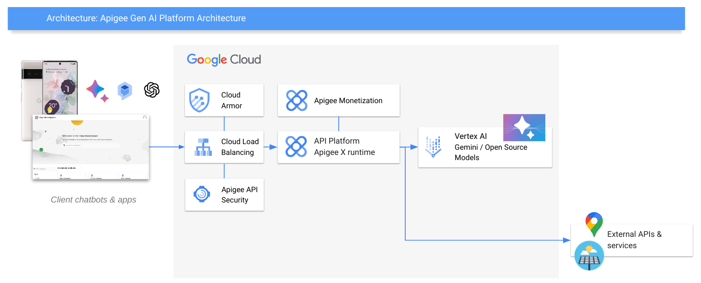

# Apigee Gen AI Solar Demo

In this project we use Google Cloud Apigee to run an API platform for our Gen AI applications. This has two aspects - one the one side we can provide APIs that AI clients can automatically understand and consume, and on the other side we can offer AI models to other applications as managed, secured APIs.

Here is an architecture overview of the solution.

Key points of the solution:
- The API layer for AI interactions is provided using standard, secured building-blocks - no custom coding needed.
- LLM apps can consume API services safely and securely, just as coded apps would use them.
- AI models can be securely offered to consuming applications through the platform.
- We have a single point for monitoring, security, access management & extensions.

You can go through the deployment steps in your own Google Cloud project by starting the codelab here:

[Apigee Gen AI Solar Demo Codelab](https://tyayers.github.io/apigee-genai-solar-demo/codelabs/apigee-api-jam-gen-ai)

Post any questions or issues here in the repository. Thanks!